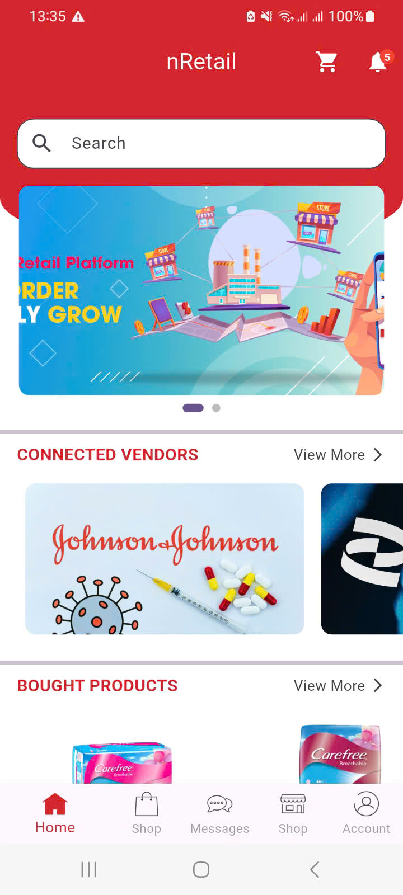
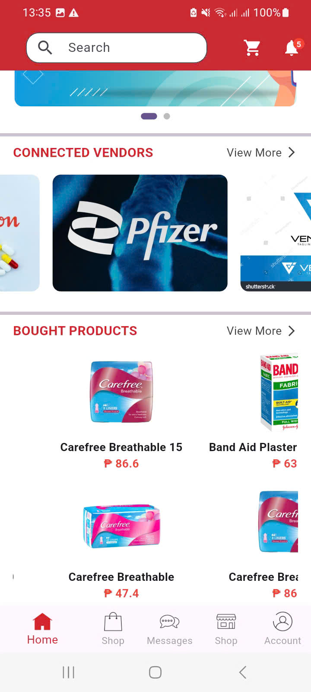
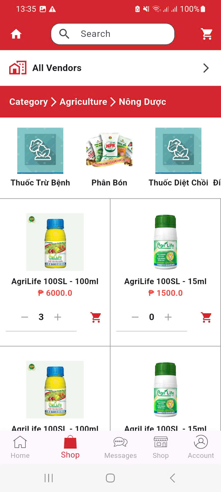
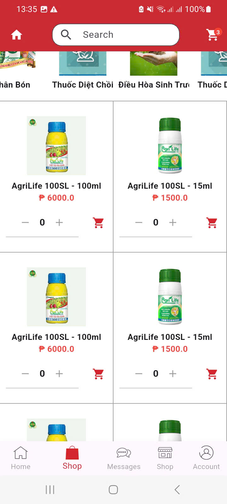

# nRetail App
Ứng dụng **nRetail** tuân theo mô hình **MVVM + Bloc**, giúp tách biệt UI, logic nghiệp vụ và xử lý dữ liệu, từ đó dễ bảo trì, kiểm thử và mở rộng ứng dụng.

## HOME UI

  
  

## SHOP UI

  
  

---

## Ghi chú

- Các hình ảnh minh họa được lưu trong thư mục `images`.
